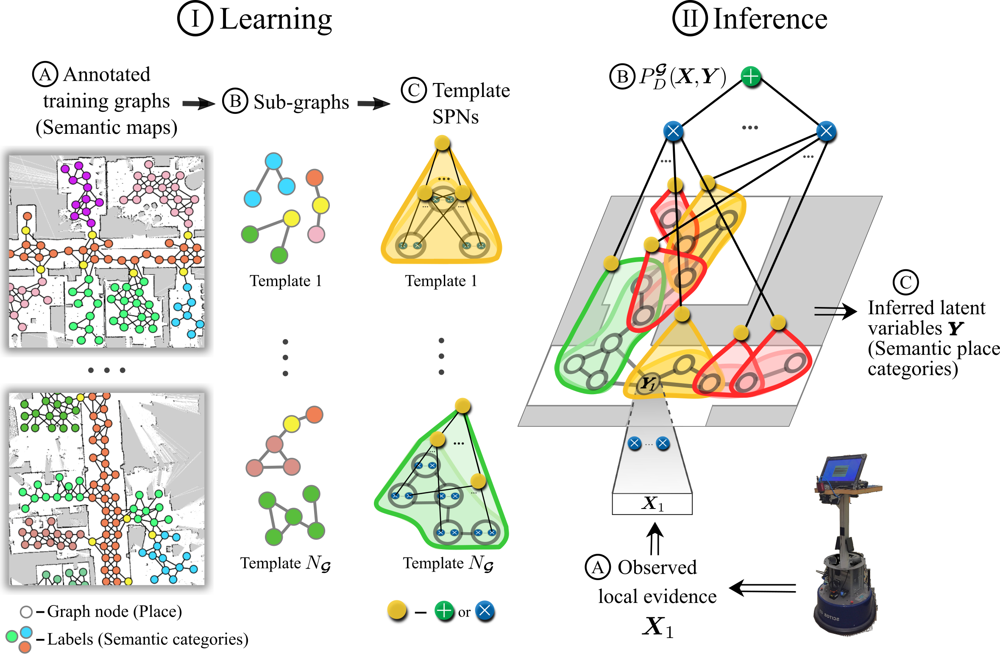

# Graph-Sturctured Sum-Product Networks (GraphSPN)

**Kaiyu Zheng^**, **Andrzej Pronobis\*^**, **Rajesh P. N. Rao^** <br>
^ University of Washington, Seattle, WA, USA. <br>
\* KTH Royal Institute of Technology, Stockholm, Sweden.<br>

**Graph-structured data** appear in a wide range of domains, from social network analysis, to computer vision and robotics. Often, the global structure of such data varies, yet dependencies captured by elements of the structure persist and can serve as a powerful source of information for various inference tasks. While many approaches to [**structured prediction**](https://en.wikipedia.org/wiki/Structured_prediction) place strict constraints on the interactions between inferred variables, many real-world problems can be only characterized using complex graph structures of varying size, often contaminated with noise when obtained from real data. <span style="color:red">We introduce **Graph-Structured Sum-Product Networks (GraphSPNs)**, a probabilistic approach to structured prediction for problems where dependencies between latent variables are expressed in terms of arbitrary, dynamic graphs.</span> 

Our framework builds on [**Sum-Product Networks (SPNs)**](https://arxiv.org/pdf/1202.3732.pdf), a recent probabilistic deep architecture with [solid theoretical foundations](http://proceedings.mlr.press/v38/peharz15.html). SPNs can learn probabilistic models capable of representing context-specific independence directly from high dimensional data and perform fast, tractable inference on high-treewidth models. As illustrated in the figure below, the learning and inference procedures of GraphSPNs are quite intuitive. GraphSPNs learn template SPN models representing distributions over attributes of sub-graphs of arbitrary complexity. Then, to perform inference for a specific, potentially expanding graph, they assemble a mixture model over multiple decompositions of the graph into sub-graphs, with each sub-graph modeled by an instantiation of an appropriate template. For more details, please refer to our <a href="http://kaiyuzheng.me/documents/papers/zheng2018aaai.pdf" style="color:blue">**AAAI'18 paper**</a>.




### Motivation from Robotics

We developed this method during our research on semantic mapping in **robotics**. while exploring their environments, robots build a growing body of knowledge captured at different spatial locations, scales, and at different levels of abstraction. Such knowledge can be represented by **semantic maps**, which are semantically annotated topological graphs grounded onto metric maps (see video below). 

<iframe width="560" height="315" src="https://www.youtube.com/embed/MGg_OY56akg" frameborder="0" allow="accelerometer; autoplay; encrypted-media; gyroscope; picture-in-picture" allowfullscreen align="middle"></iframe><br>

In order to integrate the collected spatial knowledge, resolve ambiguities, and make predictions about unobserved places, semantic mapping frameworks often employ structured prediction algorithms. Unfortunately, the relations discovered by a robot exploring a real-world environment tend to be **complex and noisy**, resulting in **difficult inference problems**. At the same time, topological graphs are **dynamic structures**, growing as the robot explores its environment, and containing a different number of nodes and relations for every environment. Therefore, we aimed to develop an approach to address these challenges, which led to <span style="color:red"> **GraphSPN**, a general probabilistic framework for modeling graph-structured data with complex, noisy dependencies between a varying number of latent variables.</span>

In our <a href="https://arxiv.org/pdf/1812.11866.pdf" style="color:blue">**IROS'19 paper**</a>, we introduced **TopoNets**, which is based on both **GraphSPN** for modeling the environment's topological structure, as well as a SPN-based method (named [**DGSM**](https://arxiv.org/pdf/1610.02627.pdf)), which classifies laser range observations into semantic place categories (e.g. office, corridor, kitchen etc.). TopoNets is a unified semantic mapping architecture that spans multiple levels of abstraction and spatial scales, from pixels (local place geometry) to semantics of buildings. Although GraphSPN was originally evaluated only with synthetic data, its practicality was demonstrated as experiments with TopoNets were conducted with a [dataset of real-world robot observations](http://kaiyuzheng.me/documents/sites/cold/), the **COLD database**.

### Code

The code of GraphSPN can be found [on github](https://zkytony/graphspn). Please follow instructions in [documentation](docs.md). Currently GraphSPN only supports templates where the data are stored on the nodes and not the edges, and the data must be discrete values. Contribution to extend GraphSPN's capabilities and applications are more than welcome.

### Citation

```tex
@inproceedings{zheng2018aaai,
  author =       {Zheng, Kaiyu and Pronobis, Andrzej and Rao, Rajesh P. N.},
  title =        {Learning {G}raph-{S}tructured {S}um-{P}roduct {N}etworks for Probabilistic Semantic Maps},
  booktitle =    {Proceedings of the 32nd AAAI Conference on Artificial Intelligence (AAAI)},
  year =         2018,
  address =      {New Orleans, LA, USA},
  month =        feb,
  archivePrefix = {arXiv},
  primaryClass = {cs.LG},
  eprint =       {1709.08274}
}
```

### Resources

Video explanation of the paper:

<iframe width="560" height="315" src="https://www.youtube.com/embed/Wojoi0elvTM" frameborder="0" allow="accelerometer; autoplay; encrypted-media; gyroscope; picture-in-picture" allowfullscreen align="middle"></iframe><br>

A shorter, better animated explanation of TopoNets (useful for understanding GraphSPN too):

<iframe width="560" height="315" src="https://www.youtube.com/embed/luv2XpaHeTU" frameborder="0" allow="accelerometer; autoplay; encrypted-media; gyroscope; picture-in-picture" allowfullscreen align="middle"></iframe>
